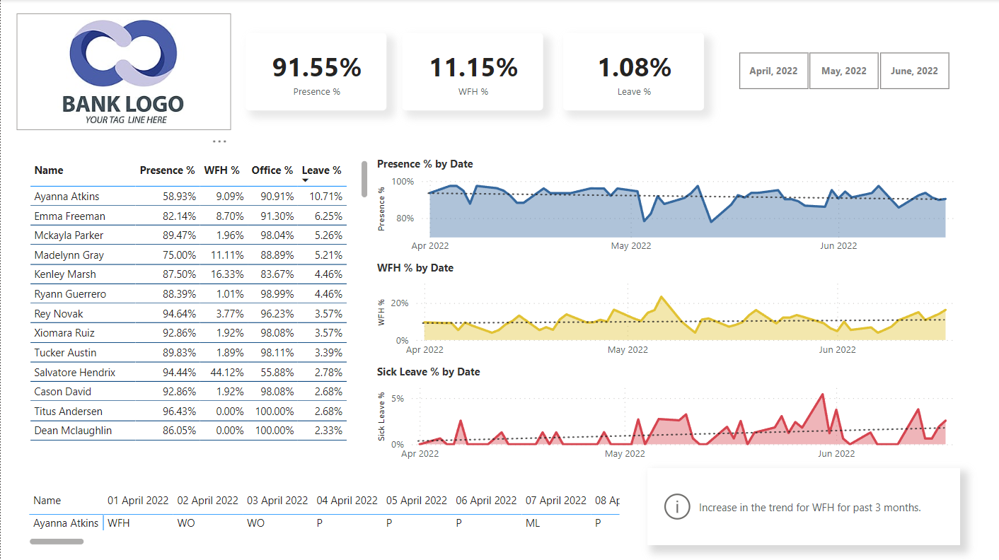

# HR Analytics Power BI Dashboard

## Overview
This Power BI dashboard analyzes employee attendance data for April, May, and June 2022, offering insights into presence, leave, and work-from-home (WFH) patterns.

## Features
- **Presence Percentage:** Overall employee presence visualization.
- **Leave Percentage:** Percentage of employees on leave.
- **WFH Percentage:** Employees working from home insights.
- **Date-wise Analysis:** Track presence, sick leave, and WFH percentages over time.
- **Employee Metrics Table:** Detailed individual metrics.

## Screenshots

## Dataset
The dataset contains employee attendance data for April, May, and June 2022 of a IT Hardware Company.
Utilizes a single dataset with columns:
- Date
- Employee Code
- Item
- Name
- Attendance_Mark (Present, Absent, WFH, etc.)

## How to Use
1. Clone the repository.
2. Open `HR_Analytics_Dashboard.pbix` using Power BI Desktop.
3. Configure data connections.
4. Refresh data for the latest insights.
5. Explore visualizations and metrics.

## Contributing
Feel free to contribute by opening issues or pull requests. Your feedback and enhancements are welcome!

## License
This project is licensed under the [MIT License](LICENSE).
